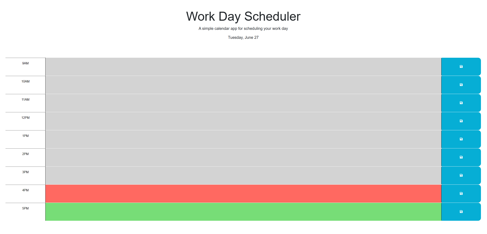
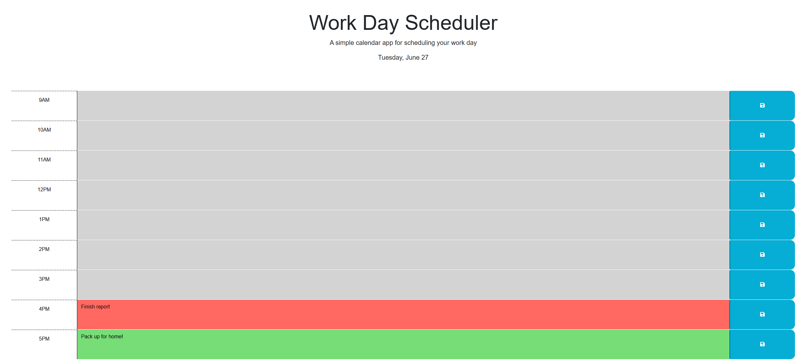

# Work Day Scheduler Starter Code

## Description

This application was created so that professionals can have a quick and easy way to plan their business day, so that they can maximise productivity. The application consists of 8 time blocks, from 9am-5pm, which the user can enter information in (e.g. tasks to do from 9am-10am). Moreover, using the save button found within each time block, the user can retain their entered information via local storage, so that the next time they open the application the information will still be there.  Furthermore, as they day goes on, the time blocks will change color to indicate if that time block has already happened, if it is in progress or if it is in the future. Finally, the application also shows the current day at the top of the page.

Below is a screenshot of the application with no user data entered: 

## Installation

N/A

## Usage
To use this application, please navigate to: https://p-h-davies.github.io/Work-Day-Scheduler/. 

Once you have arrived at that URL, you are free to begin entering your plans for your day! 

To view the current day, navigate to the top of the page where this will be displayed under 'A simple calendar app for scheduling your work day'.

To enter data, simply click the box beside your desired time and start typing.

To ensure that the data which you have entered is saved, press the blue save button pertaining to the time block whose information you wish to save. This will be stored and when you refresh the page, your entry will still be there. To add on to an entry, simply add more information and press save again. 

To understand the color key, please note the following:

- Time blocks which are grey are time blocks which have already passed.
- Time blocks which are red are time blocks in the current hour.
- Time blocks which are green are time blocks still in the future.

Below is a screenshot showing the application with user data entered:

## Credits

Starter code was provided by Xandromus (Xander Rapstine) - this code included the basic structure of the HTML, and the full code for the CSS. It also provided the empty script.js file (excluding some added comments), README file and the .gitignore.

## License

Please refer to the LICENSE in the repo.
